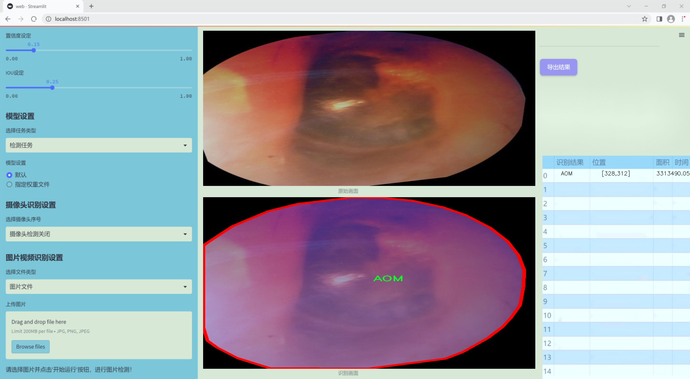
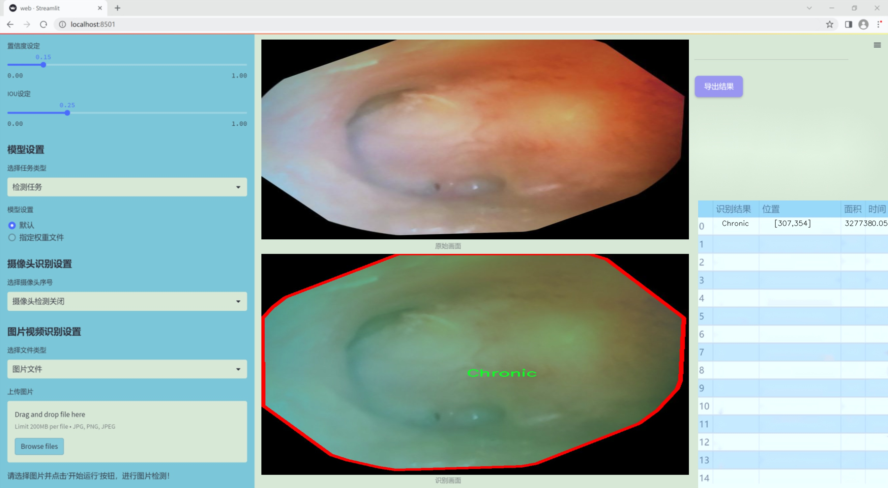
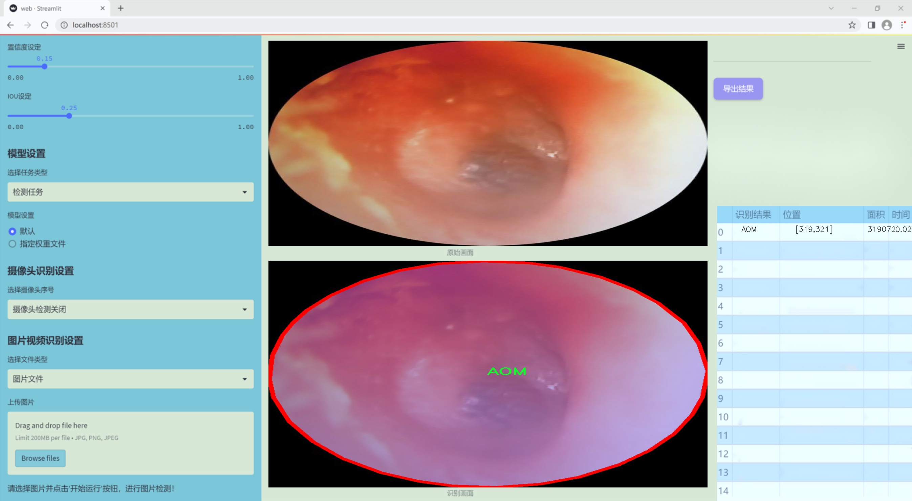
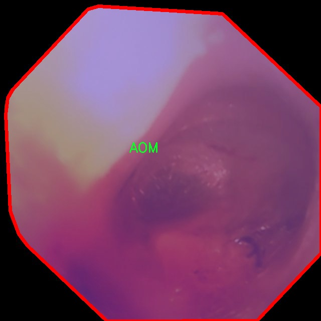
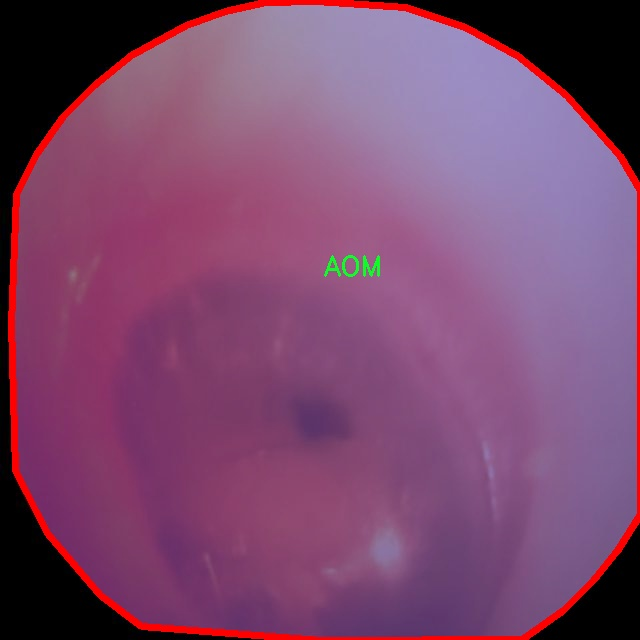
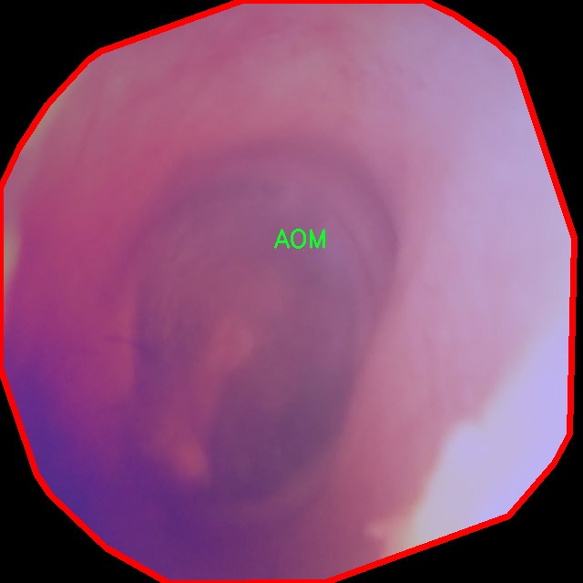
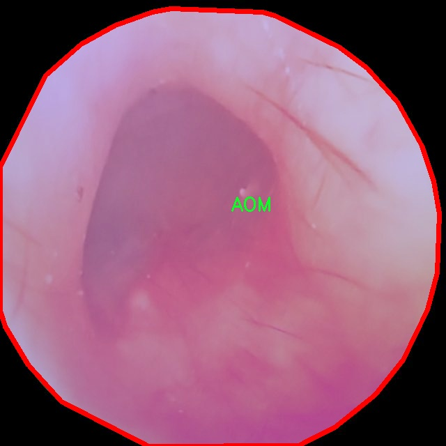
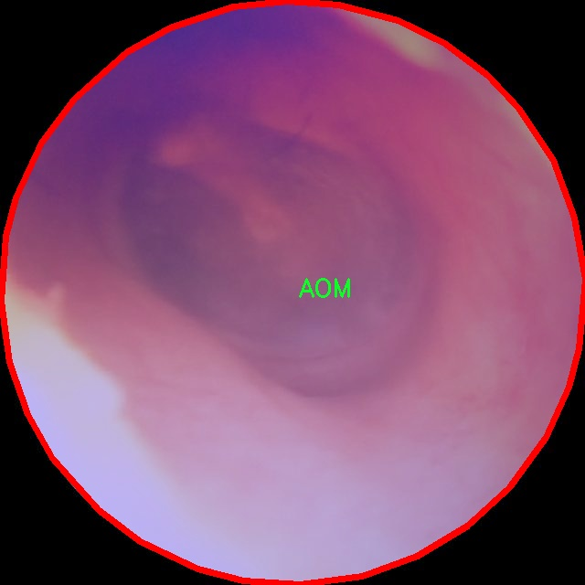

### 1.背景意义

研究背景与意义

耳部疾病的早期诊断和分类对于提高患者的治疗效果和生活质量至关重要。耳部疾病种类繁多，其中急性中耳炎（AOM）、慢性中耳炎（Chronic）、正常耳部状态（Normal）以及耳道积液（OME）是最常见的四种类型。随着全球人口老龄化及环境因素的影响，耳部疾病的发病率逐年上升，尤其是在儿童和老年人群体中。因此，开发一种高效、准确的耳部疾病分类系统，能够帮助医生在临床实践中快速识别和诊断耳部疾病，具有重要的现实意义。

近年来，深度学习技术在计算机视觉领域取得了显著进展，尤其是目标检测和图像分类任务中。YOLO（You Only Look Once）系列模型因其高效性和实时性而受到广泛关注。YOLOv11作为该系列的最新版本，结合了更先进的特征提取和处理技术，能够在保持高准确率的同时显著提高检测速度。然而，针对耳部疾病的特定应用，现有的YOLO模型仍存在一定的局限性，如对小目标的检测能力不足和对复杂背景的适应性差。因此，基于改进YOLOv11的耳镜耳部疾病分类系统的研究显得尤为重要。

本研究将利用包含2100张耳部图像的数据集进行模型训练与评估，数据集中涵盖了四种耳部疾病的标注信息。通过对YOLOv11模型的改进，旨在提升其在耳部疾病分类任务中的表现，尤其是在处理不同类型耳部疾病时的准确性和鲁棒性。此外，本研究还将探讨如何通过优化数据预处理和模型参数设置，进一步提升模型的分类效果。最终，该系统的成功开发将为耳部疾病的早期诊断提供有力支持，为医疗工作者提供更为精准的决策依据，从而推动耳部疾病防治工作的进展。

### 2.视频效果

[2.1 视频效果](https://www.bilibili.com/video/BV1fpkCYNEaC/)

### 3.图片效果







##### [项目涉及的源码数据来源链接](https://kdocs.cn/l/cszuIiCKVNis)**

注意：本项目提供训练的数据集和训练教程,由于版本持续更新,暂不提供权重文件（best.pt）,请按照6.训练教程进行训练后实现上图演示的效果。

### 4.数据集信息

##### 4.1 本项目数据集类别数＆类别名

nc: 4
names: ['AOM', 'Chronic', 'Normal', 'OME']


该项目为【图像分割】数据集，请在【训练教程和Web端加载模型教程（第三步）】这一步的时候按照【图像分割】部分的教程来训练

##### 4.2 本项目数据集信息介绍

本项目数据集信息介绍

本项目旨在开发一个改进版的YOLOv11耳镜耳部疾病分类系统，所使用的数据集名为“safEar”。该数据集专注于耳部疾病的分类，涵盖了四个主要类别，分别是急性中耳炎（AOM）、慢性中耳炎（Chronic）、正常耳部（Normal）以及耳朵积液（OME）。这些类别的选择基于耳部疾病的临床重要性和常见性，能够有效支持耳部疾病的早期诊断和治疗。

在数据集的构建过程中，确保了样本的多样性和代表性，以便模型能够学习到不同类型耳部疾病的特征。每个类别均包含大量的耳镜图像，这些图像来源于不同年龄段和性别的患者，涵盖了多种耳部病变的表现。通过对这些图像的精细标注，数据集为模型的训练提供了丰富的信息，使其能够更好地识别和分类耳部疾病。

数据集的设计考虑到了实际应用中的挑战，例如不同光照条件、耳部结构的变异以及患者的个体差异等。这些因素可能会影响耳镜图像的质量和可识别性，因此在数据集的构建过程中，特别注重了图像的质量控制和多样性，以确保模型在真实场景中的鲁棒性和准确性。

通过使用“safEar”数据集，改进后的YOLOv11模型将能够在耳部疾病的自动分类中发挥重要作用，为临床医生提供辅助决策支持，提高耳部疾病的诊断效率和准确性。这一研究不仅具有重要的临床应用价值，也为耳部疾病的相关研究提供了基础数据支持。











### 5.全套项目环境部署视频教程（零基础手把手教学）

[5.1 所需软件PyCharm和Anaconda安装教程（第一步）](https://www.bilibili.com/video/BV1BoC1YCEKi/?spm_id_from=333.999.0.0&vd_source=bc9aec86d164b67a7004b996143742dc)


[5.2 安装Python虚拟环境创建和依赖库安装视频教程（第二步）](https://www.bilibili.com/video/BV1ZoC1YCEBw?spm_id_from=333.788.videopod.sections&vd_source=bc9aec86d164b67a7004b996143742dc)

### 6.改进YOLOv11训练教程和Web_UI前端加载模型教程（零基础手把手教学）

[6.1 改进YOLOv11训练教程和Web_UI前端加载模型教程（第三步）](https://www.bilibili.com/video/BV1BoC1YCEhR?spm_id_from=333.788.videopod.sections&vd_source=bc9aec86d164b67a7004b996143742dc)


按照上面的训练视频教程链接加载项目提供的数据集，运行train.py即可开始训练



     Epoch   gpu_mem       box       obj       cls    labels  img_size
     1/200     20.8G   0.01576   0.01955  0.007536        22      1280: 100%|██████████| 849/849 [14:42<00:00,  1.04s/it]
               Class     Images     Labels          P          R     mAP@.5 mAP@.5:.95: 100%|██████████| 213/213 [01:14<00:00,  2.87it/s]
                 all       3395      17314      0.994      0.957      0.0957      0.0843

     Epoch   gpu_mem       box       obj       cls    labels  img_size
     2/200     20.8G   0.01578   0.01923  0.007006        22      1280: 100%|██████████| 849/849 [14:44<00:00,  1.04s/it]
               Class     Images     Labels          P          R     mAP@.5 mAP@.5:.95: 100%|██████████| 213/213 [01:12<00:00,  2.95it/s]
                 all       3395      17314      0.996      0.956      0.0957      0.0845

     Epoch   gpu_mem       box       obj       cls    labels  img_size
     3/200     20.8G   0.01561    0.0191  0.006895        27      1280: 100%|██████████| 849/849 [10:56<00:00,  1.29it/s]
               Class     Images     Labels          P          R     mAP@.5 mAP@.5:.95: 100%|███████   | 187/213 [00:52<00:00,  4.04it/s]
                 all       3395      17314      0.996      0.957      0.0957      0.0845


###### [项目数据集下载链接](https://kdocs.cn/l/cszuIiCKVNis)

### 7.原始YOLOv11算法讲解

YOLO11采用改进的骨干和颈部架构，增强了特征提取能力，提高了物体检测的精确度和复杂任务的表现。YOLO11引入精炼的架构设计和优化的训练流程，实现更快的处理速度，同时保持精度和性能之间的最佳平衡。通过模型设计的进步，YOLO11m在COCO数据集上实现了更高的均值平均精度（mAP），同时使用比YOLOv8m少22%的参数，使其在不妥协准确性的情况下更加计算高效。YOLO11可以无缝部署在各种环境中，包括边缘设备、云平台以及支持NVIDIA
GPU的系统，确保最大灵活性。无论是物体检测、实例分割、图像分类、姿态估计，还是定向物体检测（OBB），YOLO11都旨在应对多样的计算机视觉挑战。


##### **Ultralytics YOLO11相比于之前版本的主要改进有哪些？**

Ultralytics YOLO11在其前身基础上引入了几项重要进步。主要改进包括：

  1. **增强的特征提取** ：YOLO11采用改进的骨干和颈部架构，增强了特征提取能力，提高了物体检测的精确度。
  2.  **优化的效率和速度** ：精炼的架构设计和优化的训练流程实现了更快的处理速度，同时保持了准确性和性能之间的平衡。
  3.  **更高的准确性与更少的参数** ：YOLO11m在COCO数据集上实现了更高的均值平均精度（mAP），同时使用比YOLOv8m少22%的参数，使其在不妥协准确性的情况下更加计算高效。
  4.  **环境适应性强** ：YOLO11可以在多种环境中部署，包括边缘设备、云平台以及支持NVIDIA GPU的系统。
  5.  **支持广泛的任务** ：YOLO11支持多种计算机视觉任务，如物体检测、实例分割、图像分类、姿态估计和定向物体检测（OBB）。

我们先来看一下其网络结构有什么变化，可以看出，相比较于YOLOv8模型，其将CF2模块改成C3K2，同时在SPPF模块后面添加了一个C2PSA模块，且将YOLOv10的head思想引入到YOLO11的head中，使用深度可分离的方法，减少冗余计算，提高效率。下面我们来详细看一下这两个模块的结构是怎么构成的，以及它们为什么要这样设计


##### C3K2的网络结构

从下面图中我们可以看到，C3K2模块其实就是C2F模块转变出来的，它代码中有一个设置，就是当c3k这个参数为FALSE的时候，C3K2模块就是C2F模块，也就是说它的Bottleneck是普通的Bottleneck；反之当它为true的时候，将Bottleneck模块替换成C3模块。


##### C2PSA的网络结构

` `C2PSA是对 `C2f` 模块的扩展，它结合了PSA(Pointwise Spatial
Attention)块，用于增强特征提取和注意力机制。通过在标准 `C2f` 模块中引入 PSA
块，C2PSA实现了更强大的注意力机制，从而提高了模型对重要特征的捕捉能力。


##### **C2f 模块回顾：**

**** C2f模块是一个更快的 CSP（Cross Stage Partial）瓶颈实现，它通过两个卷积层和多个 Bottleneck
块进行特征提取。相比传统的 CSPNet，C2f 优化了瓶颈层的结构，使得计算速度更快。在 C2f中，`cv1` 是第一个 1x1
卷积，用于减少通道数；`cv2` 是另一个 1x1 卷积，用于恢复输出通道数。而 `n` 是一个包含 Bottleneck 块的数量，用于提取特征。

##### **C2PSA 模块的增强** ：

**C2PSA** 扩展了 C2f，通过引入PSA( **Position-Sensitive Attention)**
，旨在通过多头注意力机制和前馈神经网络来增强特征提取能力。它可以选择性地添加残差结构（shortcut）以优化梯度传播和网络训练效果。同时，使用FFN
可以将输入特征映射到更高维的空间，捕获输入特征的复杂非线性关系，允许模型学习更丰富的特征表示。

##### head部分

YOLO11在head部分的cls分支上使用深度可分离卷积 ，具体代码如下，cv2边界框回归分支，cv3分类分支。

    
    
     self.cv2 = nn.ModuleList(
                nn.Sequential(Conv(x, c2, 3), Conv(c2, c2, 3), nn.Conv2d(c2, 4 * self.reg_max, 1)) for x in ch
            )
            self.cv3 = nn.ModuleList(
                nn.Sequential(
                    nn.Sequential(DWConv(x, x, 3), Conv(x, c3, 1)),
                    nn.Sequential(DWConv(c3, c3, 3), Conv(c3, c3, 1)),
                    nn.Conv2d(c3, self.nc, 1),
                )
                for x in ch
            )


### 8.200+种全套改进YOLOV11创新点原理讲解

#### 8.1 200+种全套改进YOLOV11创新点原理讲解大全

由于篇幅限制，每个创新点的具体原理讲解就不全部展开，具体见下列网址中的改进模块对应项目的技术原理博客网址【Blog】（创新点均为模块化搭建，原理适配YOLOv5~YOLOv11等各种版本）

[改进模块技术原理博客【Blog】网址链接](https://gitee.com/qunmasj/good)


#### 8.2 精选部分改进YOLOV11创新点原理讲解

###### 这里节选部分改进创新点展开原理讲解(完整的改进原理见上图和[改进模块技术原理博客链接](https://gitee.com/qunmasj/good)【如果此小节的图加载失败可以通过CSDN或者Github搜索该博客的标题访问原始博客，原始博客图片显示正常】

### ParC融合位置感知循环卷积简介
ParC：Position aware circular convolution


#### Position aware circular convolution
针对于全局信息的提取作者提出了Position aware circular convolution（也称作Global Circular Convolution）。图中左右实际是对于该操作水平竖直两方向的对称，理解时只看左边即可。对于维度为C*H*W的输入，作者先将维度为C*B*1的Position Embedding通过双线性插值函数F调整到适合input的维度C*H*1（以适应不同特征大小输入），并且将PE水平复制扩展到C*H*W维度与输入特征相加。这里作者将PE直接设置成为了可学习的参数。

接下来参考该博客将加入PE的特征图竖直方向堆叠，并且同样以插值的方式得到了适应输入维度的C*H*1大小的卷积核，进行卷积操作。对于这一步卷积，作者将之称为循环卷积，并给出了一个卷积示意图。


但个人感觉实际上这个示意图只是为了说明为什么叫循环卷积，对于具体的计算细节还是根据公式理解更好。


进一步，作者给出了这一步的伪代码来便于读者对这一卷积的理解：y=F.conv2D（torch.cat（xp，xp，dim=2），kV），实际上就是将xp堆叠之后使用了一个“条形（或柱形）”卷积核进行简单的卷积操作。（但这样会导致多一次重复卷积，因此在堆叠示意图中只取了前2*H-1行）

可以看到在示意图中特征维度变化如下：C*(2H-1)*W ---C*H*1--->C*H*W，作者特意带上了通道数，并且并没有出现通道数的改变，那么这里所进行的卷积应该是depth wise卷积，通过对文章后续以及论文源码的阅读可以得知这一步进行的就是DW卷积。（we introduce group convolution and point wise convolution into these modules, which decreases number of parameters without hurting performance.）


由groups = channel可知使用的是DW卷积
通过上面就完成了一次竖直方向的全局信息交流，同样只要在水平方向进行同样的操作即可做到水平方向的全局信息交流。

#### ParC block

通过ParC成功解决了全局信息提取的问题，接下来就是针对2）3）两点进行改进。首先是Meta-Former模块，Meta-Former由Token Mixer和Channel Mixer构成，ParC首先满足了Token Mixer的全局信息提取的要求，并且相较于Attention在计算成本上更低。


这里①中的PWC即point wise conv，进一步验证了我们前面对于深度可分离卷积的想法，而GCC-H/V即是前面所说的ParC-H/V。

①构建了Meta-Former中的Token mixer模块，那么最后剩下的问题就是3），替换掉Attention模块之后模型不再data driven。为了解决这一点作者给出了一个channel wise attention，先将特征图（x,C*H*W）进行global average（a,C*1*1）并输入一个MLP生成一个channel wise的权重（w,C*1*1），再将权重与特征图在通道方向相乘得到输出（output = wx,C*H*W）。

#### ParC net
对于ParC net 的搭建，作者直接基于MobileViT，采用了分叉结构（c）完成了网络的搭建。


具体而言作者保留了MobileViT中浅层具有局部感受野的MobileNetV2结构，而将网络深层的ViT block替换成了ParC block，使网络变成了一个pure ConvNet。


### 9.系统功能展示

图9.1.系统支持检测结果表格显示

  图9.2.系统支持置信度和IOU阈值手动调节

  图9.3.系统支持自定义加载权重文件best.pt(需要你通过步骤5中训练获得)

  图9.4.系统支持摄像头实时识别

  图9.5.系统支持图片识别

  图9.6.系统支持视频识别

  图9.7.系统支持识别结果文件自动保存

  图9.8.系统支持Excel导出检测结果数据


### 10. YOLOv11核心改进源码讲解

#### 10.1 dynamic_snake_conv.py

以下是对给定代码的核心部分进行简化和详细注释的版本。保留了最重要的类和方法，以便于理解其功能。

```python
import torch
import torch.nn as nn
from ..modules.conv import Conv

__all__ = ['DySnakeConv']

class DySnakeConv(nn.Module):
    def __init__(self, inc, ouc, k=3) -> None:
        """
        初始化动态蛇形卷积层
        :param inc: 输入通道数
        :param ouc: 输出通道数
        :param k: 卷积核大小
        """
        super().__init__()
        
        # 定义标准卷积层
        self.conv_0 = Conv(inc, ouc, k)
        # 定义沿x轴和y轴的动态蛇形卷积
        self.conv_x = DSConv(inc, ouc, 0, k)
        self.conv_y = DSConv(inc, ouc, 1, k)
    
    def forward(self, x):
        """
        前向传播
        :param x: 输入特征图
        :return: 拼接后的输出特征图
        """
        # 将三个卷积的输出在通道维度上拼接
        return torch.cat([self.conv_0(x), self.conv_x(x), self.conv_y(x)], dim=1)

class DSConv(nn.Module):
    def __init__(self, in_ch, out_ch, morph, kernel_size=3, if_offset=True, extend_scope=1):
        """
        动态蛇形卷积
        :param in_ch: 输入通道数
        :param out_ch: 输出通道数
        :param morph: 卷积核的形态（0表示沿x轴，1表示沿y轴）
        :param kernel_size: 卷积核大小
        :param if_offset: 是否使用偏移
        :param extend_scope: 偏移范围
        """
        super(DSConv, self).__init__()
        # 用于学习可变形偏移的卷积层
        self.offset_conv = nn.Conv2d(in_ch, 2 * kernel_size, 3, padding=1)
        self.bn = nn.BatchNorm2d(2 * kernel_size)
        self.kernel_size = kernel_size

        # 定义沿x轴和y轴的卷积层
        self.dsc_conv_x = nn.Conv2d(in_ch, out_ch, kernel_size=(kernel_size, 1), stride=(kernel_size, 1), padding=0)
        self.dsc_conv_y = nn.Conv2d(in_ch, out_ch, kernel_size=(1, kernel_size), stride=(1, kernel_size), padding=0)

        self.gn = nn.GroupNorm(out_ch // 4, out_ch)  # 组归一化
        self.act = Conv.default_act  # 默认激活函数

        self.extend_scope = extend_scope
        self.morph = morph
        self.if_offset = if_offset

    def forward(self, f):
        """
        前向传播
        :param f: 输入特征图
        :return: 卷积后的特征图
        """
        # 计算偏移
        offset = self.offset_conv(f)
        offset = self.bn(offset)
        offset = torch.tanh(offset)  # 将偏移限制在[-1, 1]之间

        # 获取输入特征图的形状
        input_shape = f.shape
        dsc = DSC(input_shape, self.kernel_size, self.extend_scope, self.morph)  # 创建DSC对象
        deformed_feature = dsc.deform_conv(f, offset, self.if_offset)  # 进行可变形卷积

        # 根据形态选择对应的卷积操作
        if self.morph == 0:
            x = self.dsc_conv_x(deformed_feature.type(f.dtype))
        else:
            x = self.dsc_conv_y(deformed_feature.type(f.dtype))

        x = self.gn(x)  # 进行组归一化
        x = self.act(x)  # 应用激活函数
        return x

class DSC(object):
    def __init__(self, input_shape, kernel_size, extend_scope, morph):
        """
        动态蛇形卷积的核心部分
        :param input_shape: 输入特征图的形状
        :param kernel_size: 卷积核大小
        :param extend_scope: 偏移范围
        :param morph: 卷积核的形态
        """
        self.num_points = kernel_size
        self.width = input_shape[2]
        self.height = input_shape[3]
        self.morph = morph
        self.extend_scope = extend_scope  # 偏移范围

        # 定义特征图的形状
        self.num_batch = input_shape[0]
        self.num_channels = input_shape[1]

    def deform_conv(self, input, offset, if_offset):
        """
        进行可变形卷积
        :param input: 输入特征图
        :param offset: 偏移
        :param if_offset: 是否使用偏移
        :return: 变形后的特征图
        """
        y, x = self._coordinate_map_3D(offset, if_offset)  # 计算坐标映射
        deformed_feature = self._bilinear_interpolate_3D(input, y, x)  # 进行双线性插值
        return deformed_feature

    def _coordinate_map_3D(self, offset, if_offset):
        """
        计算3D坐标映射
        :param offset: 偏移
        :param if_offset: 是否使用偏移
        :return: y和x坐标映射
        """
        # 省略具体实现，返回y和x的坐标映射
        pass

    def _bilinear_interpolate_3D(self, input_feature, y, x):
        """
        进行3D双线性插值
        :param input_feature: 输入特征图
        :param y: y坐标
        :param x: x坐标
        :return: 插值后的特征图
        """
        # 省略具体实现，返回插值后的特征图
        pass
```

### 代码说明
1. **DySnakeConv 类**：这是一个包含标准卷积和动态蛇形卷积的复合卷积层。它在前向传播中将三个卷积的输出拼接在一起。
   
2. **DSConv 类**：实现了动态蛇形卷积的具体逻辑。它通过学习偏移量来实现卷积核的动态变形。

3. **DSC 类**：这是动态蛇形卷积的核心，负责计算变形后的特征图。它包含坐标映射和双线性插值的实现。

4. **前向传播**：每个类的 `forward` 方法定义了如何处理输入数据并生成输出。`DSConv` 类的 `forward` 方法使用偏移量进行变形卷积。

以上是对代码的核心部分进行简化和注释的版本，旨在帮助理解其主要功能和结构。

这个文件定义了一个动态蛇形卷积（Dynamic Snake Convolution）模块，主要用于深度学习中的卷积操作。文件中包含了两个主要的类：`DySnakeConv` 和 `DSConv`，以及一个辅助类 `DSC`，用于实现动态卷积的核心逻辑。

首先，`DySnakeConv` 类是一个卷积神经网络模块的子类。它的构造函数接收输入通道数 `inc`、输出通道数 `ouc` 和卷积核大小 `k` 作为参数。在初始化过程中，它创建了三个卷积层：`conv_0` 是标准卷积，`conv_x` 和 `conv_y` 是动态蛇形卷积，分别沿着 x 轴和 y 轴进行卷积。在前向传播方法 `forward` 中，它将输入 `x` 传递给这三个卷积层，并将它们的输出在通道维度上拼接起来，形成最终的输出。

接下来，`DSConv` 类实现了动态蛇形卷积的具体逻辑。构造函数中定义了输入和输出通道数、卷积核大小、形态参数、是否使用偏移等参数。它使用一个额外的卷积层 `offset_conv` 来学习偏移量，并通过批归一化层 `bn` 对偏移量进行归一化处理。根据形态参数 `morph` 的不同，`DSConv` 可以选择在 x 轴或 y 轴上进行卷积操作。前向传播方法中，首先计算偏移量，然后调用 `DSC` 类来进行特征图的变形卷积。

`DSC` 类是动态卷积的核心，负责生成坐标映射和进行双线性插值。它的构造函数接收输入特征图的形状、卷积核大小、扩展范围和形态参数。`_coordinate_map_3D` 方法根据偏移量生成新的坐标映射，而 `_bilinear_interpolate_3D` 方法则使用双线性插值来获取变形后的特征图。`deform_conv` 方法将输入特征图和偏移量传递给上述两个方法，返回变形后的特征图。

整体而言，这个文件实现了一个创新的卷积操作，允许卷积核根据输入特征图的内容进行动态调整，从而提高了模型的表达能力和灵活性。

#### 10.2 prepbn.py

以下是代码中最核心的部分，并附上详细的中文注释：

```python
import torch
import torch.nn as nn

# 定义一个自定义的批量归一化类
class RepBN(nn.Module):
    def __init__(self, channels):
        super(RepBN, self).__init__()
        # 定义一个可学习的参数 alpha，初始值为 1
        self.alpha = nn.Parameter(torch.ones(1))
        # 定义一个一维的批量归一化层
        self.bn = nn.BatchNorm1d(channels)

    def forward(self, x):
        # 将输入张量的维度进行转置，以适应 BatchNorm1d 的输入要求
        x = x.transpose(1, 2)
        # 进行批量归一化，并加上 alpha * x
        x = self.bn(x) + self.alpha * x
        # 再次转置回原来的维度
        x = x.transpose(1, 2)
        return x

# 定义一个线性归一化类
class LinearNorm(nn.Module):
    def __init__(self, dim, norm1, norm2, warm=0, step=300000, r0=1.0):
        super(LinearNorm, self).__init__()
        # 注册一些缓冲区，用于控制训练过程中的参数
        self.register_buffer('warm', torch.tensor(warm))  # 预热步数
        self.register_buffer('iter', torch.tensor(step))  # 当前迭代步数
        self.register_buffer('total_step', torch.tensor(step))  # 总步数
        self.r0 = r0  # 初始权重
        # 初始化两个归一化层
        self.norm1 = norm1(dim)
        self.norm2 = norm2(dim)

    def forward(self, x):
        if self.training:  # 如果处于训练模式
            if self.warm > 0:  # 如果还有预热步数
                self.warm.copy_(self.warm - 1)  # 减少预热步数
                x = self.norm1(x)  # 使用 norm1 进行归一化
            else:
                # 计算当前的 lamda 值
                lamda = self.r0 * self.iter / self.total_step
                if self.iter > 0:
                    self.iter.copy_(self.iter - 1)  # 减少迭代步数
                # 分别使用 norm1 和 norm2 进行归一化
                x1 = self.norm1(x)
                x2 = self.norm2(x)
                # 线性组合两个归一化的结果
                x = lamda * x1 + (1 - lamda) * x2
        else:
            # 如果不在训练模式，直接使用 norm2 进行归一化
            x = self.norm2(x)
        return x
```

### 代码核心部分解释：
1. **RepBN 类**：自定义的批量归一化层，除了进行标准的批量归一化外，还引入了一个可学习的参数 `alpha`，用于调整输入特征的影响。

2. **LinearNorm 类**：实现了一种动态的归一化策略。在训练过程中，前 `warm` 步使用 `norm1` 进行归一化，之后根据当前迭代步数动态调整 `norm1` 和 `norm2` 的权重，形成一个平滑的过渡。这种方法可以在训练的不同阶段灵活调整归一化的方式，提高模型的性能。

这个程序文件 `prepbn.py` 定义了两个神经网络模块，分别是 `RepBN` 和 `LinearNorm`，它们都是继承自 PyTorch 的 `nn.Module` 类，用于实现特定的归一化操作。

`RepBN` 类的构造函数接受一个参数 `channels`，表示输入数据的通道数。在初始化过程中，它创建了一个可学习的参数 `alpha`，并实例化了一个一维批量归一化层 `BatchNorm1d`。在前向传播方法 `forward` 中，输入张量 `x` 首先进行维度转换，以便适应批量归一化的要求。接着，输入张量经过批量归一化处理后，与 `alpha` 乘以的原始输入相加，最后再进行一次维度转换以恢复原来的形状。这种结构可以增强模型的表达能力，允许网络在训练过程中自适应地调整归一化的影响。

`LinearNorm` 类的构造函数接受多个参数，包括维度 `dim`、两个归一化方法 `norm1` 和 `norm2`，以及一些用于控制训练过程的参数，如 `warm`（预热期）、`step`（当前迭代步数）和 `r0`（初始比例）。在初始化时，它将这些参数注册为缓冲区，以便在训练过程中进行管理。在前向传播方法中，如果模型处于训练状态且 `warm` 大于零，则会执行 `norm1` 归一化，并减少 `warm` 的值。当 `warm` 为零时，计算一个动态的比例 `lamda`，该比例依赖于当前的迭代步数和总步数。接着，输入数据分别经过 `norm1` 和 `norm2` 归一化，最终输出的结果是这两者的加权和。如果模型不在训练状态，则直接使用 `norm2` 进行归一化。

整体来看，这个文件实现了两种不同的归一化方法，旨在提高深度学习模型的训练效果和稳定性。`RepBN` 通过引入可学习的参数增强了批量归一化的灵活性，而 `LinearNorm` 则通过动态调整归一化策略来适应训练过程中的不同阶段。

#### 10.3 transformer.py

以下是经过简化并添加详细中文注释的核心代码部分：

```python
import torch
import torch.nn as nn
from functools import partial

# 导入自定义的归一化模块
from .prepbn import RepBN, LinearNorm
from ..modules.transformer import TransformerEncoderLayer

# 定义线性归一化和RepBN的组合
ln = nn.LayerNorm
linearnorm = partial(LinearNorm, norm1=ln, norm2=RepBN, step=60000)

class TransformerEncoderLayer_RepBN(TransformerEncoderLayer):
    def __init__(self, c1, cm=2048, num_heads=8, dropout=0, act=..., normalize_before=False):
        # 初始化父类的构造函数
        super().__init__(c1, cm, num_heads, dropout, act, normalize_before)
        
        # 使用线性归一化和RepBN进行归一化
        self.norm1 = linearnorm(c1)
        self.norm2 = linearnorm(c1)

class AIFI_RepBN(TransformerEncoderLayer_RepBN):
    """定义AIFI变换器层。"""

    def __init__(self, c1, cm=2048, num_heads=8, dropout=0, act=nn.GELU(), normalize_before=False):
        """使用指定参数初始化AIFI实例。"""
        super().__init__(c1, cm, num_heads, dropout, act, normalize_before)

    def forward(self, x):
        """AIFI变换器层的前向传播。"""
        c, h, w = x.shape[1:]  # 获取输入张量的通道数、高度和宽度
        pos_embed = self.build_2d_sincos_position_embedding(w, h, c)  # 构建位置嵌入
        # 将输入张量从形状[B, C, H, W]展平为[B, HxW, C]
        x = super().forward(x.flatten(2).permute(0, 2, 1), pos=pos_embed.to(device=x.device, dtype=x.dtype))
        # 将输出张量的形状从[B, HxW, C]转换回[B, C, H, W]
        return x.permute(0, 2, 1).view([-1, c, h, w]).contiguous()

    @staticmethod
    def build_2d_sincos_position_embedding(w, h, embed_dim=256, temperature=10000.0):
        """构建2D正弦-余弦位置嵌入。"""
        assert embed_dim % 4 == 0, "嵌入维度必须是4的倍数，以便进行2D正弦-余弦位置嵌入"
        grid_w = torch.arange(w, dtype=torch.float32)  # 创建宽度的网格
        grid_h = torch.arange(h, dtype=torch.float32)  # 创建高度的网格
        grid_w, grid_h = torch.meshgrid(grid_w, grid_h, indexing="ij")  # 生成网格坐标
        pos_dim = embed_dim // 4  # 计算位置嵌入的维度
        omega = torch.arange(pos_dim, dtype=torch.float32) / pos_dim  # 计算频率
        omega = 1.0 / (temperature**omega)  # 根据温度调整频率

        # 计算宽度和高度的正弦和余弦值
        out_w = grid_w.flatten()[..., None] @ omega[None]
        out_h = grid_h.flatten()[..., None] @ omega[None]

        # 返回组合的正弦和余弦位置嵌入
        return torch.cat([torch.sin(out_w), torch.cos(out_w), torch.sin(out_h), torch.cos(out_h)], 1)[None]
```

### 代码注释说明：
1. **导入模块**：导入必要的PyTorch模块和自定义的归一化及变换器模块。
2. **归一化定义**：使用`partial`定义了一个结合了线性归一化和RepBN的归一化函数。
3. **TransformerEncoderLayer_RepBN类**：继承自`TransformerEncoderLayer`，在初始化时定义了两个归一化层。
4. **AIFI_RepBN类**：定义了AIFI变换器层，包含前向传播方法和位置嵌入构建方法。
5. **前向传播**：在前向传播中，输入张量被展平并传递给父类的前向方法，最后将输出张量恢复为原始形状。
6. **位置嵌入构建**：静态方法生成2D正弦-余弦位置嵌入，确保嵌入维度为4的倍数，并计算每个位置的正弦和余弦值。

这个程序文件定义了一个用于实现变换器（Transformer）模型的类，主要是对变换器编码器层进行扩展，加入了特定的归一化方法。代码中使用了PyTorch库，主要涉及到神经网络的构建和前向传播。

首先，文件导入了必要的库，包括PyTorch的核心模块和一些自定义的模块。`RepBN`和`LinearNorm`是自定义的归一化方法，而`TransformerEncoderLayer`和`AIFI`则是变换器的基本构件。

接下来，定义了一个名为`TransformerEncoderLayer_RepBN`的类，它继承自`TransformerEncoderLayer`。在构造函数中，调用了父类的构造函数，并定义了两个归一化层`norm1`和`norm2`，这两个层使用了之前定义的`linearnorm`，后者是一个偏函数，结合了层归一化和`RepBN`，并设置了一个步数参数。

然后，定义了另一个类`AIFI_RepBN`，它继承自`TransformerEncoderLayer_RepBN`，并实现了AIFI变换器层的功能。在构造函数中，除了调用父类的构造函数外，还可以指定激活函数（默认为GELU）。这个类的核心是`forward`方法，它实现了前向传播的逻辑。

在`forward`方法中，首先获取输入张量`x`的形状信息，包括通道数`c`、高度`h`和宽度`w`。接着，调用`build_2d_sincos_position_embedding`方法生成二维的正弦余弦位置嵌入，这对于变换器模型来说是非常重要的，因为它帮助模型理解输入数据的空间结构。然后，将输入张量从形状`[B, C, H, W]`转换为`[B, HxW, C]`，并调用父类的`forward`方法进行处理，最后将输出结果恢复为原来的形状。

`build_2d_sincos_position_embedding`是一个静态方法，用于构建二维的正弦余弦位置嵌入。该方法首先检查嵌入维度是否能被4整除，这是生成位置嵌入的要求。接着，创建了宽度和高度的网格，并计算出相应的正弦和余弦值，最终返回一个包含这些值的张量。

整体来看，这个文件实现了一个自定义的变换器编码器层，结合了新的归一化方法和位置嵌入的生成方式，适用于处理具有空间结构的数据，如图像等。

#### 10.4 val.py

以下是经过简化并添加详细中文注释的核心代码部分：

```python
import os
import torch
from ultralytics.engine.validator import BaseValidator
from ultralytics.utils.metrics import DetMetrics, box_iou
from ultralytics.utils import LOGGER, ops

class DetectionValidator(BaseValidator):
    """
    扩展自BaseValidator类的检测模型验证器。
    """

    def __init__(self, dataloader=None, save_dir=None, args=None):
        """初始化检测模型，设置必要的变量和参数。"""
        super().__init__(dataloader, save_dir, args)
        self.metrics = DetMetrics(save_dir=self.save_dir)  # 初始化检测指标
        self.iouv = torch.linspace(0.5, 0.95, 10)  # 定义IOU阈值范围
        self.niou = self.iouv.numel()  # IOU数量

    def preprocess(self, batch):
        """对图像批次进行预处理，以便于YOLO训练。"""
        batch["img"] = batch["img"].to(self.device, non_blocking=True)  # 将图像转移到设备上
        batch["img"] = batch["img"].float() / 255  # 将图像归一化到[0, 1]
        for k in ["batch_idx", "cls", "bboxes"]:
            batch[k] = batch[k].to(self.device)  # 将其他数据转移到设备上
        return batch

    def postprocess(self, preds):
        """对预测输出应用非极大值抑制（NMS）。"""
        return ops.non_max_suppression(
            preds,
            self.args.conf,
            self.args.iou,
            multi_label=True,
            max_det=self.args.max_det,
        )

    def update_metrics(self, preds, batch):
        """更新检测指标。"""
        for si, pred in enumerate(preds):
            npr = len(pred)  # 当前预测数量
            pbatch = self._prepare_batch(si, batch)  # 准备当前批次数据
            cls, bbox = pbatch.pop("cls"), pbatch.pop("bbox")  # 获取真实标签
            if npr == 0:
                continue  # 如果没有预测，跳过

            predn = self._prepare_pred(pred, pbatch)  # 准备预测数据
            stat = {
                "conf": predn[:, 4],  # 置信度
                "pred_cls": predn[:, 5],  # 预测类别
                "tp": self._process_batch(predn, bbox, cls)  # 计算真阳性
            }
            self.metrics.process(**stat)  # 更新指标

    def _process_batch(self, detections, gt_bboxes, gt_cls):
        """
        返回正确的预测矩阵。
        """
        iou = box_iou(gt_bboxes, detections[:, :4])  # 计算IOU
        return self.match_predictions(detections[:, 5], gt_cls, iou)  # 匹配预测与真实标签

    def get_stats(self):
        """返回指标统计和结果字典。"""
        stats = {k: torch.cat(v, 0).cpu().numpy() for k, v in self.stats.items()}  # 转换为numpy
        if len(stats) and stats["tp"].any():
            self.metrics.process(**stats)  # 处理指标
        return self.metrics.results_dict  # 返回结果字典

    def print_results(self):
        """打印每个类别的训练/验证集指标。"""
        pf = "%22s" + "%11i" * 2 + "%11.3g" * len(self.metrics.keys)  # 打印格式
        LOGGER.info(pf % ("all", self.seen, self.nt_per_class.sum(), *self.metrics.mean_results()))  # 打印总体结果
```

### 代码说明：
1. **DetectionValidator类**：这是一个用于验证YOLO检测模型的类，继承自`BaseValidator`。
2. **初始化方法**：设置必要的参数和指标，定义IOU的范围。
3. **预处理方法**：将输入的图像批次转移到指定设备，并进行归一化处理。
4. **后处理方法**：应用非极大值抑制（NMS）来过滤掉冗余的预测框。
5. **更新指标方法**：更新当前批次的检测指标，包括计算真阳性等。
6. **处理批次方法**：计算预测框与真实框之间的IOU，并返回匹配结果。
7. **获取统计信息方法**：返回当前的指标统计信息。
8. **打印结果方法**：打印整体和每个类别的检测结果。

这个程序文件 `val.py` 是一个用于目标检测模型验证的类 `DetectionValidator` 的实现，主要基于 Ultralytics YOLO 框架。该类继承自 `BaseValidator`，提供了一系列方法来处理验证过程中的数据预处理、指标计算、结果输出等功能。

在初始化方法中，`DetectionValidator` 设置了一些必要的变量和参数，包括数据加载器、保存目录、进度条、参数设置等。它还定义了一些用于计算检测指标的属性，如 `DetMetrics` 和 `ConfusionMatrix`，并初始化了一些用于后续计算的张量。

`preprocess` 方法负责对输入的图像批次进行预处理，包括将图像数据转移到指定设备（如 GPU），并进行归一化处理。它还处理了用于自动标注的边界框信息。

`init_metrics` 方法用于初始化评估指标，包括检查数据集是否为 COCO 格式，并设置相关的类映射和统计信息。

`get_desc` 方法返回一个格式化的字符串，用于总结每个类的指标信息。

`postprocess` 方法应用非极大值抑制（NMS）来处理模型的预测输出，以减少重叠的检测框。

`_prepare_batch` 和 `_prepare_pred` 方法分别用于准备输入批次和预测结果，以便进行后续的评估。

`update_metrics` 方法负责更新检测指标，处理每个批次的预测结果与真实标签的比较，并更新混淆矩阵和其他统计信息。

`finalize_metrics` 方法在验证结束时设置最终的指标值，包括计算速度和混淆矩阵。

`get_stats` 方法返回当前的指标统计信息，计算每个类的目标数量。

`print_results` 方法用于打印训练或验证集的每个类的指标信息，并可视化混淆矩阵。

`_process_batch` 方法计算正确预测的矩阵，使用 IoU（交并比）来评估预测框与真实框的匹配情况。

`build_dataset` 和 `get_dataloader` 方法用于构建 YOLO 数据集和返回数据加载器，以便在验证过程中使用。

`plot_val_samples` 和 `plot_predictions` 方法用于可视化验证样本和预测结果，生成带有标签和预测框的图像。

`save_one_txt` 和 `pred_to_json` 方法分别用于将检测结果保存为文本文件和 COCO 格式的 JSON 文件，以便后续分析和评估。

`eval_json` 方法用于评估 YOLO 输出的 JSON 格式结果，并返回性能统计信息，特别是计算 mAP（平均精度均值）。

总体而言，这个文件实现了一个完整的目标检测模型验证流程，包括数据预处理、指标计算、结果输出和可视化等功能，适用于使用 YOLO 模型进行目标检测任务的场景。

### 11.完整训练+Web前端界面+200+种全套创新点源码、数据集获取


# [下载链接：https://mbd.pub/o/bread/Z5ybm55x](https://mbd.pub/o/bread/Z5ybm55x)